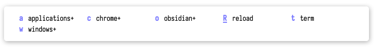
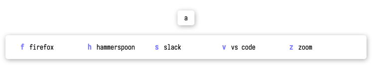
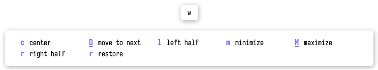

# micro.chords

micro.chords provides key chords to organize hammerspoon functionality as
an alternative to traditional key bindings, along with a visual interface
for discoverability.

For exmaple, hitting the `<LEADER>` keybinding brings up the root menu:



Then, hitting `c` brings up the Chrome sub-menu:



In this way, all of your hammerspoon functions can be accessed via a single global keybinding.

It is possible to create multilpe trees accessed from different keybindings, access a subtree directly from a global keybinding, or only put functionality that you use less often behind a key chord.

Inspired by the likes of [Spacemacs](https://www.spacemacs.org/), [Doom Emacs](https://github.com/doomemacs/doomemacs), and [mini.clue](https://github.com/echasnovski/mini.nvim/blob/main/readmes/mini-clue.md),

## Configuration

```clojure
;; A chord-tree is just a tree data structure, built out of nodes in the form
;; of [:key :name list-or-function], where a list as the last element creates
;; a sub-menu and a function as the last element invokes hammerspoon
;; functionality.

(local chord-tree [
    ;; Create a sub-menu to launch or focus various applications:
    [:a :applications+ [
        [:f :firefox #(hs.application.launchOrFocus "Firefox")]
        [:v "vs code" #(hs.application.launchOrFocus "Visual Studio Code")]
        [:s :slack #(hs.application.launchOrFocus "Slack")]
        [:h :hammerspoon #(hs.application.launchOrFocus "Hammerspoon")]
        [:z :zoom #(hs.application.launchOrFocus "Zoom.us")]
    ]]

    ;; Sub-menu names have a `+` postfix by convention:
    [:c :chrome+ [
        [:c :chrome #(hs.application.launchOrFocus "Google Chrome")]
        ;; Can invoke library provided functions directly:
        [:n "new window" chrome.new-window]
        [:l "copy link" copy_rich_link.getRichLinkToCurrentChromeTab]
        [:r "-> read later" copy_rich_link.getCurrentChromeTabAsMdDoc]
    ]]

    ;; Or can import a sub-tree directly from another module:
    [:w :windows+ wm.chords]

    ;; Functions don't need to be in a sub-menu, useful for oft-used
    ;; functionality:
    [:t :term #(hs.application.launchOrFocus "Alacritty")]
    [:R :reload #(hs.reload)]
])
```

### Hydras

Sometimes there is a sub-menu with functions that are convenient to use repeatedly, as is often
the case when managing windows. You might want to split, move windows around, and resize windows
all before resuming other work. To handle this use case, micro.chords provides hydras.

```clojure
    [:w :windows+ {:hydra true} [
        [:n "next window" ...]
        [:p "prev window" ...]
        [:m "minimize" ...]
        [:M "maximize" ...]
        [:l "left half" ...]
        [:r "right half" ...]
        [:c "center" ...]
    ]]
```

Given the above config, hitting `<LEADER>w` opens the `windows` sub-menu like normal:



However, completing an action (say, minimizing an unwanted window) doesn't exit the
key chord prompt: instead, it resets back to having entered the `windows` sub-menu,
allowing you to quickly trigger other window management functionality.

This would allow
a string of key presses such a `<LEADER>w m m n r n n l`, where everything after `<LEADER>w`
triggering actions from the `windows` sub-menu (spaces added for clarity).

Hydras support sub-menus after the sub-menu marked `hydra`: context will always be returned
to the most-recently-used sub-menu marked with `{:hydra true}`.

To exit, hit `escape`, or any other unbound key.

Inspired by the Emacs package [Hydra](https://github.com/abo-abo/hydra), 

## Integration

Here is an example of integrating key chords into your hammerspoon config:

```clojure
;; .hammerspoon/main.fnl

;; Import the core functionality.
(local chords (require :micro.chords))
;; The UI is packaged seperately if you don't want to see the next set
;; of available keys displayed, or if you want to hook up your own UI.
(local chords-ui (require :micro.chords.ui))

;; See the example chord-tree above for a more sophisticated example.
(local chord-tree [
    [:R :reload #(hs.reload)]
])

;; `chorder-ui` is defined once-per hammerspoon session to manage the
;; drawing canvas. 
(local chorder-ui (chords-ui.make-chorder-ui))

;; A hotkey is bound in the normal fashion that invokes a new chorder
;; and is provided the chord tree to operate on. In this case, the
;; leader key is defined as `<CMD>u`.
(hs.hotkey.bind [:cmd] :u
    ;; A new `chorder` is created each time the hotkey is invoked, as it
    ;; only manages the lifecycle of a single chord session.
    ;; 
    ;; `chorder-ui.on-event` is passed so the UI can respond to the changing
    ;; state of the `chorder`.
    #(chords.make-chorder chord-tree chorder-ui.on-event))

;; NOTE: a wrapper of `#(xpcall ... report-error)` is elided for simplicity,
;; but adding an error boundry here is suggested in the event that the
;; actions being executed hit an error state.
```

## Potential features

**Hydra stacks**: when in a sub-menu marked `{:hydra true}` that is itself beneath a
menu marked `{:hydra true}`, there is no way to return the context to the higher level
hydra.
